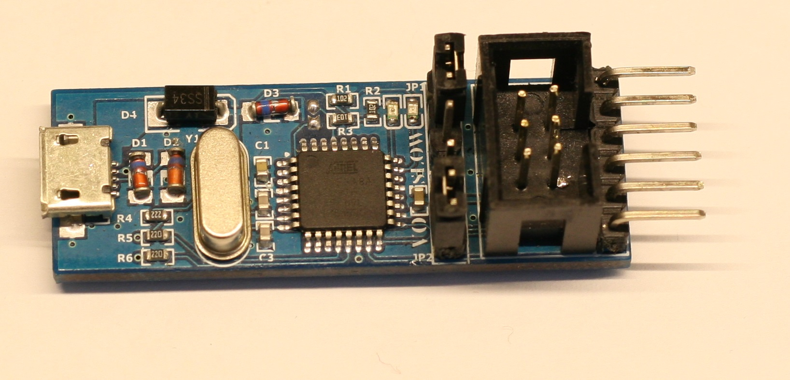
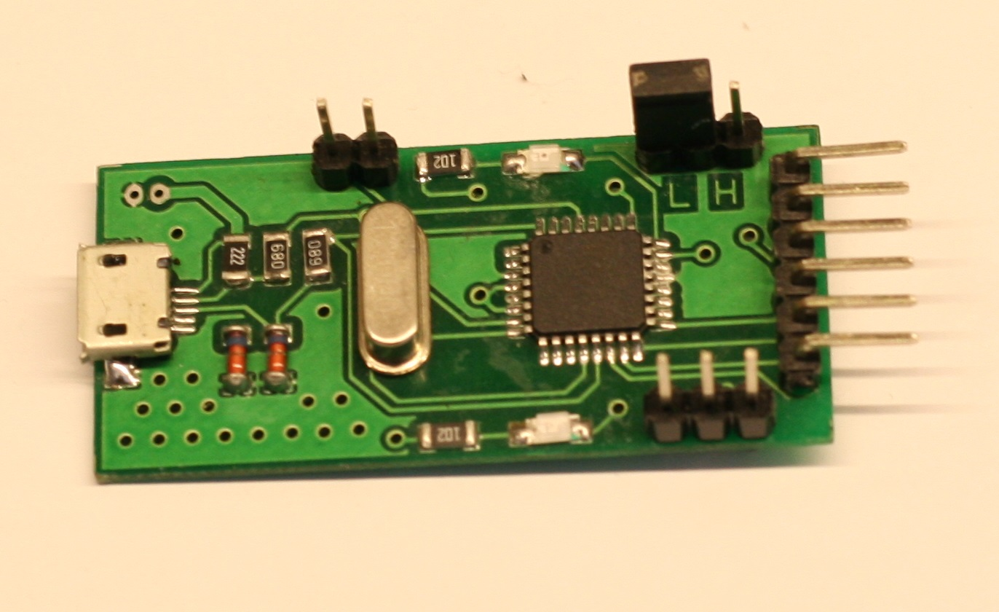

# USBASP AVR programmer
USBaps is an open-source project created by [Thomas Fischl](https://www.fischl.de/usbasp/) to be able to program the AVR chips in circuit via USB. 

I used Thomas schematics and designed my own PCBs. I designed 2 versions, trying to be as compact as possible. The programmers have micro-USB connectors and can easily connect via a USB cable.
There are two jumper selectors on the programmer. One can select the speed of programming, Low speed for microcontrollers with clock frequency below 8 MHz. The second one is to connect the USB power to the output power pin. It can be used to power up the target microcontroller in case the target does not have independent power supply.

